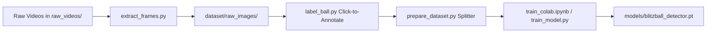

# Blitzball Pitch Tracker Pro

> **Automated Computer Vision Umpire & Live Match Bookkeeping Suite for Blitzball**  
> Real-time Computer Vision ball tracking, automated strike/ball calls, official Blitzball rule enforcement (5 Balls & 2 Lobs), and broadcast-grade desktop interface.

---

## Key Features

- **Dual AI & CV Pitch Detection**:
  - **YOLOv8 AI Sports Ball Detector**: Neural network specifically trained to detect `sports ball` objects while ignoring bats, gloves, people, and background scenery.
  - **High-Speed CV Mode**: Dual-color HSV masking + temporal frame differencing.
- **Physical Pitch Vector Verification**:
  - **Mound-to-Plate Vector Gating**: Rejects false triggers that originate near the plate (e.g. bat knob wiggles, batter warmup steps) or in the outfield.
  - **2.5-Second Anti-Spam Debounce Lockout**: Prevents duplicate auto-calls during ball retrieval, swings, or catcher throw-backs.
- **Pitch Corridor Detection (ROI)**: Restricts ball detection to an active corridor around the strike zone and pitching tunnel, rejecting ground clutter, stationary balls on turf, and peripheral movement.
- **Interactive Strike Zone Calibration**: 4-corner click calibration directly on the video canvas with a 9-box K-Zone grid overlay.
- **Official Blitzball Rule Engine**:
  - **5 Balls** triggers the **2-Lob Walk Phase**.
  - **2 Lobs**: Pitcher throws 2 lobs; batter can put the ball in play or complete the walk.
  - **3 Strikes** for a strikeout.
  - **3 Outs** switches half-innings automatically.
- **Broadcast-Grade Desktop GUI (PySide6)**: Dark-mode sports analytics interface with live scorebug, pitch trajectory trails, LED count matrix, and one-click umpire overrides.
- **Multi-Source Video Engine**:
  - **Live Camera / HDMI Capture Cards**: Real-time tracking for live match play.
  - **Local Video Files**: Test with pre-recorded `.mp4`, `.mov`, `.avi` footage.
  - **YouTube Streaming & Cache**: Seamless YouTube video downloading & caching via `yt-dlp`.
- **Automated Box Scores & Data Logging**: Exports detailed game summaries, pitcher/batter stat cards (H, BB, K, Strike %, PA), and pitch-by-pitch trajectory records to `game_summary.json`.

---

## Project Structure

```
blitzball/
├── gui.py             # Broadcast-grade PySide6 Desktop GUI & Custom Canvas
├── main.py            # Master entry point (GUI / CLI launchers)
├── tracker.py         # Multi-color HSV detection, corridor ROI & trajectory math
├── calibrator.py      # Strike zone 4-point quadrilateral calibration
├── detector.py        # YOLOv8 / Classical CV pitch detection engine
├── state_machine.py   # Blitzball rules engine (5 balls, 2 lobs, 3 strikes, outs, lineups)
├── video_source.py    # Multi-source resolver (Webcams, files, yt-dlp caching)
├── logger.py          # Box score analytics & JSON export engine
├── extract_frames.py  # Ingest raw_videos/ and extract sequential pitch frames
├── label_ball.py      # Interactive CV2 click-to-annotate tool with 4x loupe
├── prepare_dataset.py # Train/Val 80/20 splitter and data.yaml generator
├── train_model.py     # Local YOLOv8 training CLI utility
├── train_colab.ipynb  # Google Colab GPU training notebook
├── requirements.txt   # Core dependencies (PySide6, OpenCV, NumPy, yt-dlp, ultralytics)
├── .gitignore         # Repository ignore rules
└── README.md          # Documentation & user manual
```

---

## Installation & Setup

### 1. Prerequisites
Ensure you have **Python 3.10+** installed.

### 2. Clone Repository & Install Dependencies
```bash
git clone https://github.com/YOUR_USERNAME/blitzball-pitch-tracker.git
cd blitzball-pitch-tracker
pip install -r requirements.txt
```

---

## How to Run

### Launch Desktop GUI (Recommended)
```bash
python main.py
```

### Launch with Direct Source Flags
```bash
# Launch directly with a live webcam or USB capture card:
python main.py --camera 0

# Launch directly with a YouTube video URL:
python main.py --video "https://www.youtube.com/watch?v=YOUR_VIDEO_ID"

# Launch with a local test video file:
python main.py --video "path/to/match_footage.mp4"
```

### Headless / CLI Mode
```bash
python main.py --cli --video match.mp4
```

---

## Keyboard Shortcuts & Umpire Controls

| Key | Action |
| :---: | :--- |
| `[Space]` | Pause / Resume Video Playback |
| `[S]` | Call Strike (or Swing & Miss) |
| `[B]` | Call Ball (5th Ball activates 2-Lob phase) |
| `[H]` | Record Base Hit (Advances batter, resets count) |
| `[F]` | Record Foul Ball (Adds strike if strikes < 2) |
| `[O]` | Record In-Play Out (Flyout / Groundout) |
| `[L]` | Record Lob Hit (Hit during 2-Lob phase) |
| `[Q]` | Quit Application & Save Session Summary |

---

## Official Blitzball Game Rules Implemented

1. **Count System**:
   - **Strikes**: 3 strikes = Strikeout (`outs += 1`, count resets, batter advances).
   - **Balls**: 5 balls = Walk Phase triggered.
2. **2-Lob Phase**:
   - When a batter draws 5 balls, they enter the **2-Lob Phase**.
   - The pitcher throws up to 2 lobs.
   - If the batter hits a lob -> **Ball in play / Hit**.
   - If the batter hits an out -> **Out recorded**.
   - If 2 lobs elapse without a hit -> **Walk completed** (batter takes 1st base).
3. **Innings**:
   - 3 Outs switches half-inning (Top to Bottom, or Bottom to Next Inning).
   - Active lineup order rotates automatically with roster management.

---

## Exported Box Score Schema (`game_summary.json`)

On match conclusion or when clicking **Export Summary**, the session data is saved:

```json
{
  "pitcher_box_scores": {
    "Home P1": {
      "pitches_thrown": 34,
      "strikes": 22,
      "balls": 12,
      "strike_pct": 64.7,
      "K": 4,
      "BB": 1,
      "H": 2
    }
  },
  "batter_box_scores": {
    "Away P1": {
      "PA": 3,
      "H": 1,
      "BB": 1,
      "K": 1,
      "pitches_seen": 14
    }
  },
  "pitch_log": [
    {
      "pitch_id": "p001",
      "pitcher": "Home P1",
      "batter": "Away P1",
      "call": "STRIKE",
      "trajectory_points": [[640, 180, 0.0], [635, 240, 0.033], [620, 360, 0.066]],
      "final_coord": [615, 480],
      "in_zone": true
    }
  ]
}
```

---

## 🎯 Custom YOLOv8 Blitzball Training Pipeline

Train high-accuracy deep learning Blitzball detection weights tailored to your camera angles and lighting:



### 1. Extract Frames from Footage
Drop match video files into `raw_videos/` (or supply `--video` / `--youtube`):
```bash
python extract_frames.py --step 2 --active-only
```
- Automatically outputs sequential zero-padded frames (`frame_0001.jpg`, `frame_0002.jpg`, ...) to `dataset/raw_images/`.

### 2. Rapid Click-to-Annotate Tool
Launch the interactive OpenCV labeling canvas:
```bash
python label_ball.py
```
- **Left Mouse Click**: Register ball center (creates bounding box, default 28x28 px).
- **Mouse Wheel / `[` `]`**: Dynamically resize bounding box.
- **`[Space]` / `[Enter]`**: Save YOLO annotation (.txt) and advance.
- **`[S]`**: Skip frame (marks frame as background / occlusion).
- **`[R]`**: Reset current frame annotation.
- **`[A]` / `[D]`**: Navigate backward / forward.
- **`[Z]`**: Toggle real-time 4x Magnifier Loupe for pixel-accurate centering.
- **`[Q]`**: Save progress and quit.

### 3. Split Dataset & Generate `data.yaml`
```bash
python prepare_dataset.py --val-ratio 0.20 --zip
```
- Splits labeled data into standard YOLO `images/train`, `images/val`, `labels/train`, `labels/val` (80/20 ratio).
- Automatically writes `dataset/data.yaml`.
- Packages `dataset.zip` for instant upload to Google Colab.

### 4. Train on Google Colab (or Locally)
- Open [`train_colab.ipynb`](file:///C:/Users/Miraj%20Shah/Desktop/Personal%20Projects/blitzball/train_colab.ipynb) on Google Colab (GPU accelerated: T4 / A100).
- Run training with `epochs=60`, `imgsz=640`, `batch=16`.
- Download `blitzball_detector.pt` and place it in `models/blitzball_detector.pt`.
- Or train locally:
  ```bash
  python train_model.py --epochs 60 --imgsz 640 --batch 16
  ```

---

## License
MIT License. Built for Blitzball communities and leagues.
